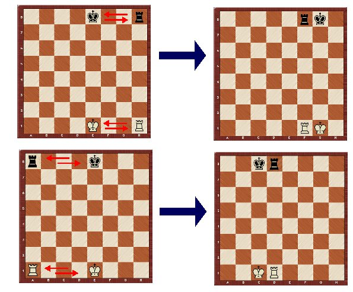
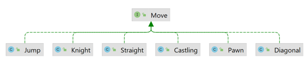

## Eighth iteration
In this iteration, you will get to practice ordered collections and anonymous classes.

1. Define the **natural order** on the `Coordinates` class according to the `equals` method, i.e., 
   it is sorted according to the `letterNumber` in ascending order, and in case of a match, 
   it is sorted by `number` in ascending order.
   > for example a1 < a6 < c0 < f5
2. Update the method `allPossibleMovesByCurrentPlayer` in the `Game`.
   - Create an **anonymous class** of the interface `Comparator<Coordinates>` and override the method `compare`
     so it compares precisely in the reverse order compared to the natural order on the `Coordinates`.
   - Return the result in the order based on this comparator.
3. Add method `isInDanger` in the `Chess`, which takes two integers representing `Coordinates`
   and `color` as input parameters.
   - The method controls if the position is in danger by the player with the input color.
     If the position is in danger, return `true` otherwise return `false`.
   - **Watch out** for the case when you find out that a position is in danger by a Pawn.
4. Create class `Castling` implementing `Move` in package `moves`.
   - The method `getAllowedMoves` returns **all possible positions** for the piece at the position in the game.
     Castling has multiple conditions which must be met.
      - Every position between the king and a rook must be empty and can not be in danger
        (the opponent can not be able to move their piece to that position).
      - The king and a rook **have not been moved** since the beginning of the game (use `mementoHistory`).
      - Notice that you **do not** need to control the type of piece
        because you control that the piece at the position did not move from the start of the game.
      - Do not forget that there is **big** and **small** castling.

     .

5. **Overload** and modify the method `getAllPossibleMoves` in the `Piece`.
   - The overloaded method also takes a parameter of the type boolean that controls whether the result can include castling moves.
   - In the original method, the default value of this parameter is `false`.
6. Edit the executable class `Main`. Test **time complexity** by `System.currentTimeMillis()`.
   - Create a private static method without a return value that takes one input parameter of the type `Collection`.
     In the method add 10 000 random Coordinates to the collection.
     After that remove 1 000 random Coordinates from the collection.
   - Print the **duration** of the method when input parameter is `HashSet` and `ArrayList`
     in the format `<timeOfHashSet> < <timeOfArrayList>` and on the next line print the result of the expression.

.

Hints:
- [Rules for castling.](https://en.wikipedia.org/wiki/Castling#Rules)
- In `Main` create a constant value for an instance of the class `Random`.

