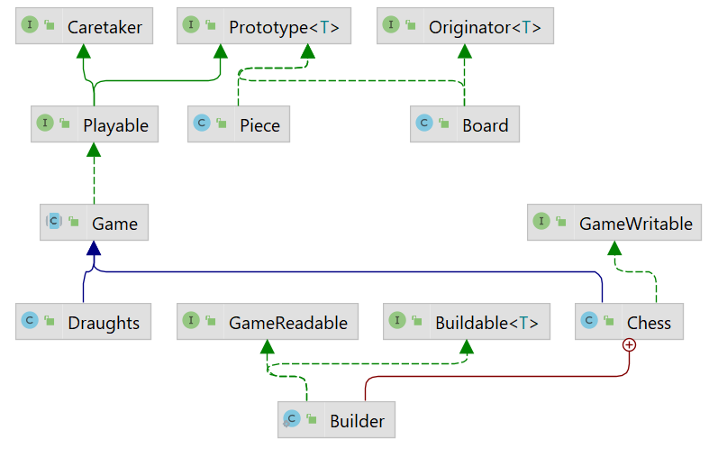

## Tenth iteration
This iteration serves to practice creating tests and working with input and output.

1. **Modify** the `Chess.Builder` class to implement the `GameReadable` interface.
    - The `read(InputStream)` method takes **an open input** containing the board, reads the board,
      and transforms it.
    - The overloaded method takes except `InputStream` also boolean representing if the file has `header`.
    - For any input/output error or input data format error, **the method must fail** and throw an `IOException`.
      The input data format is as follows for the initial layout with players "Mat" and " Pat"(the first row is **header**):
    ```
        Mat-WHITE;Pat-BLACK
        ROOK,WHITE;PAWN,WHITE;_;_;_;_;PAWN,BLACK;ROOK,BLACK
        KNIGHT,WHITE;PAWN,WHITE;_;_;_;_;PAWN,BLACK;KNIGHT,BLACK
        BISHOP,WHITE;PAWN,WHITE;_;_;_;_;PAWN,BLACK;BISHOP,BLACK
        QUEEN,WHITE;PAWN,WHITE;_;_;_;_;PAWN,BLACK;QUEEN,BLACK
        KING,WHITE;PAWN,WHITE;_;_;_;_;PAWN,BLACK;KING,BLACK
        BISHOP,WHITE;PAWN,WHITE;_;_;_;_;PAWN,BLACK;BISHOP,BLACK
        KNIGHT,WHITE;PAWN,WHITE;_;_;_;_;PAWN,BLACK;KNIGHT,BLACK
        ROOK,WHITE;PAWN,WHITE;_;_;_;_;PAWN,BLACK;ROOK,BLACK
    ```
    - Each row is on one line.
    - Each piece is separate from the other in a row by `;` and `_` representing the null value.
2. **Modify** the `Chess` class to implement the `GameWritable` interface.
    - The `write(OutputStream)` method writes the board to a given output stream.
      The output format is the same as for the previous method.
3. Write basic **tests** to class `MyArray`.
    - Tests do not cover this part. Your teacher will control it.


Hints:
- Avoid duplicated code by calling one method from the other one.
- Only **close** streams/files that you have opened.
- Use try with resources.
- Study the methods `Writer#flush()`, `Reader#ready()`.
- You can create a file using `new File("soubor.txt")`.
- `Main.main` can throw `IOException`.
- Do not forget to use **the universal line break separator** `System.lineSeparator()` instead of `\n`.
- The tests create a `game-out.txt` file.

.