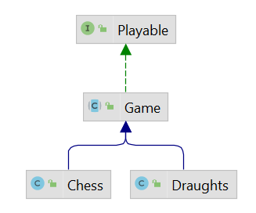

## Fifth iteration
In this iteration, you will practice inheritance, abstract classes, and work with strings in a loop.

1. Add `DRAUGHTS_KING` and  `DRAUGHTS_MAN` to `PieceType`.
2. Create class `Chess` that will inherit from the class `Game`.
    - Make `Game` abstract with **abstract** method `updateStatus`.
    - Move all specific code about chess to `Chess`.
3. Create class `Draughts`. It will have a different initial set, move, and ending conditions than the class `Chess`.
    - It will inherit from class `Game`.
        - The method `setInitialSet` sets the initial layout of the draughts pieces.
        - The method `move` will work with two options.
            - If you move the piece only by one square, the method puts the piece in a new position.
            - If you move the piece by two squares, the method removes the piece between the old and the new position.
              > For example, if you move the piece from `(0,0)` to `(2,2)`, then you must remove the piece on `(1,1)`.
            - You can assume that you get a valid input.
    - The method `updateStatus` changes status if a player wins. If there is no piece of one color on the board,
      the player of the other color has won.
4. Add control of castling in method `move` in `Chess`.
    - When castling occurs, the input of the method `move` will be the old position and the new position of king.
      You must, in this method, move rook. (It is not necessary to check whether castling may occur.
      Assume that all conditions are fulfilled.)

   .

5. Add `toString` to `Board`. Return value `toString()` of the board with the initial position of the pieces looking like this
```
   1   2   3   4   5   6   7   8
  --------------------------------
A | R | P |   |   |   |   | P | R |
  --------------------------------
B | K | P |   |   |   |   | P | K |
  --------------------------------
C | B | P |   |   |   |   | P | B |
  --------------------------------
D | Q | P |   |   |   |   | P | Q |
  --------------------------------
E | K | P |   |   |   |   | P | K |
  --------------------------------
F | B | P |   |   |   |   | P | B |
  --------------------------------
G | K | P |   |   |   |   | P | K |
  --------------------------------
H | R | P |   |   |   |   | P | R |
  --------------------------------
```

.

Hints:
- Use `StringBuilder` instead of adding strings using the plus sign.
- Use `System.lineSeparator()` instead of `\n`.
- [Initial position of Draughts.](https://en.wikipedia.org/wiki/English_draughts#Starting_position)
 
