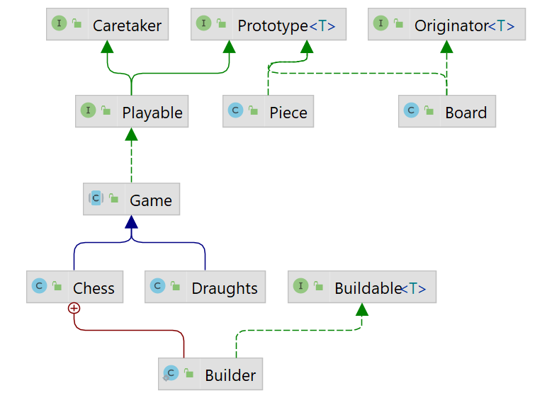

## Ninth iteration
1. Create exceptions `EmptySquareException`, `InvalidFormatOfInputException`,
   `MissingPlayerException` and `NotAllowedMoveException`.
    - `EmptySquareException` and `NotAllowedMoveException` are **checked** exceptions.
    - `InvalidFormatOfInputException` and `MissingPlayerException` are **unchecked** exceptions.
    - In each class create at least **two constructors** which calls constructor from super class.
2. Create a **nested utility class** `Builder`in `Chess`, that is `Chess.Builder` which implements interface `Buildable`.
    - This class takes care of creating the game.
    - Method `addPlayer` takes player as an input parameter. On the first call, the first player is added,
      the second call of this method adds the second player.
    - Method `addPieceToBoard` takes piece and position **in chess notation** as input parameters. It puts piece on board.
    - Both methods return instance of buildable, so you can chain calls of methods sequentially.
    - The `build` method returns a new `Chess` instance filled with players and board with pieces.
    - Usage:
        ```java
        Chess game = new Chess.Builder()
                 .addPlayer(new Player("Mat", Color.WHITE))
                 .addPlayer(new Player("Pat", Color.BLACK))
                 .addPieceToBoard(new ChessPieceFactory().createPiece(PieceType.KING, Color.WHITE), 'e', 1)
             .build();
        ```
3. **Update implementation using exceptions**.
    - The method `play` in `Game` throws:
        - `EmptySquareException` if user want to move a piece from the empty position
          or the position is not in board.
        - `NotAllowedMoveException` if user want to do illegal move.
        - `InvalidFormatOfInputException` if user input is in wrong format.
            - Input must be `<char><int> <char><int>`.
    - In the class `Builder`, if you call the method `build()`, both players must be added already.
      If not, throw an exception `MissingPlayerException`.
    - Do not forget to write meaningful messages to exceptions.
4. Modify interface `Prototype` using generics. Replace `Piece` with generic type.
   Make `Playeble`, `Board`, `Piece` implement `Prototype` and implement method `makeCopy`.
5. Modify the method `allPossibleMovesByCurrentPlayer` in the `Game`.
- Create **anonymous** class of interface `Comparator<Coordinate>` and override method `compare`
  so that it compares exactly in **the reverse order** as the method `compare` in `Coordinates`.
- Return result in order based on this comparator.


.


Hints:
- If you want to know more about the builder design pattern
  you can click on [link](https://refactoring.guru/design-patterns/builder).
- You can use regions to better organize your code.
  ```java
     ///region Buildable 
         code
     ///endregion Buildable
    ```
