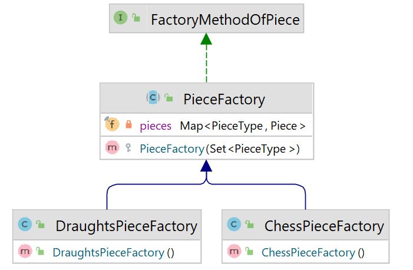

## Seventh iteration
In this iteration, you will practice working with inheritance, collections, streams, and basic exceptions.

1. Create classes `Pawn` and `Knight` implementing `Move` from the package `moves`.
    - Method `getAllowedMoves` returns **all possible destinations** for the piece at a given `position` in the given `game`.
    - All returned positions must be **empty** or **occupied by** a piece of the **opposite color**.
    - The class `Knight` (L move) does not have any attribute.
        - It is a straight move by two squares, rotation by 90 degrees to one side, and moving by one square.
    - The class `Pawn` is a straight move forward by one or two steps if the position is empty.
        - If a piece is **not** moved already (its position is the second column in the case of the white pieces
          or the seventh column in the case of the black pieces), then the piece can move by one or two steps forward.
          Otherwise, only a move by one step is allowed.
        - `Pawn` move also includes a diagonal move forward by one step if the tile is occupied by the opposite color.
          (There is also a rare `Pawn` movement called En passant, which we neglect in our implementation)
2. Add a method `getSymbol` to `PieceType`.
    - The method returns a string that contains only one Unicode character.
      based on the `color` (given as an input parameter) and `piecetype`.
    - **Do not use `if` or `switch`**. Classes `Pair` and `Map` can make your implementation easier.
    - You can find the Unicode characters for all needed combinations of `color` and `piecetype`
      **[here]**(https://www.fileformat.info/info/unicode/index.htm).
3. Modify the `Piece` class.
    - Add an attribute `moves`. It is a **list of classes implementing interface** `Move` representing all movements 
      that the piece can do. Do not forget that we **do not want** to give a chance 
      to anybody to change the attribute by getter.
    - Add the method `getAllPossibleMoves`, which takes one input parameter of the type `game` and returns a set of all possible coordinates where the piece can move. **Use streams**.
    - Update the constructor, methods `makeCopy` and `toString`.
        - The constructor takes another input parameter to set `moves`.
        - Update method `makeCopy` because we have a new attribute.
        - Modify the method `toString` to return a symbol of the piece using `getSymbol` from `PieceType`.
4. **Change the creation of pieces** by using the design pattern **[Factory Method](https://refactoring.guru/design-patterns/factory-method)**.
    - Create an abstract class `PieceFactory` implementing `FactoryMethodOfPiece`.
        - It has one attribute of the type `Map<PieceType, Piece>`. The map contains every `PieceType` which the constructor gets
          and the prototype of a piece with this type and the corresponding moves.
        - It has a protected constructor which takes a set of `pieceType` as an input parameter and sets the attribute of the class.
        - The method `createSetOfPrototypes` is **abstract**.
        - The method `createPiece` returns a piece with the type and the color given as input parameters.
    - Create `ChessPieceFactory` and `DraughtsPieceFactory`.
        - Both classes extend the `PieceFactory` and have constructors without parameters
          which give a superclass set of `PieceType` that are in the game.
        - If the `createPiece` method gets an unknown `pieceType` throw `IllegalArgumentException` with **appropriate message**.
        - If the `createSetOfPrototypes` method gets an unknown `pieceType` throw `IllegalArgumentException`
          with **appropriate message**.
    - Do not forget to update the creation of pieces in the method `setInitialSet` in `Chess` and `Draughts`.

   .

5. Add a method `allPossibleMovesByCurrentPlayer` to `Game`, which returns a set of all possible moves
   that the current player can make. **Use streams**.

Hints:
- Some IDEs do not have a default monospace font for Unicode characters. You can set the monospace font in the settings.
  Some recommended monospace fonts supporting Unicode characters:
  DejaVu Sans Mono,  Everson Mono, FreeSerif, Chrysanthi Unicode,...
- **Moves by chess pieces**.
    - The king can move in any direction by one step and castling (next iteration).
    - The queen can move in any direction by any number of steps.
    - A rook can move straight by any number of steps.
    - A bishop can move diagonally by any number of steps.
    - A knight can move in "L" shape (knight move).
    - A pawn can move one or two steps forward based on his position.
- **Moves by draughts pieces**.
    - The king can move diagonally by one step and jump.
    - A man can move like the king but only in the forward direction.
- Some methods for working with the streams are `map`, `filter`, and `flatmap`.
- If you want to use streams in arrays, the static method `Arrays.stream(...)` could be helpful.

