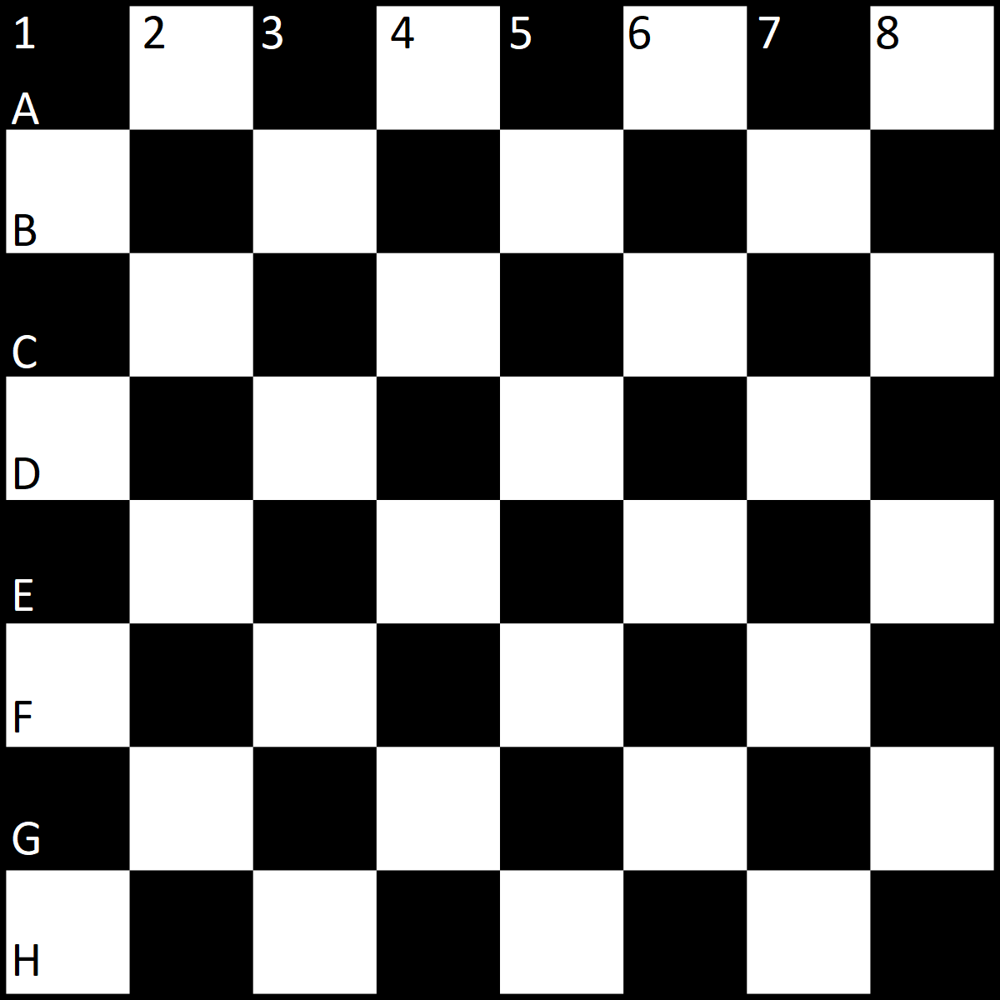

## Second iteration 

1. Create package `utils` and class `BoardNotation` in it.
   - Add private constructor without paramters to avoid initializing.
   - Add private constant for char value of letter `a`.
     - Create static method `getNotationOfCoordinates` and `getCoordinatesOfNotation`. 
       These methods transform coordinate of board to chess notation and reverse.
       > `getNotationOfCoordinates(0, 5)` takes two integers and returns string `"a6"` 

         `getCoordinatesOfNotation(b, 3)` takes character, integer and returns string `"24"`
2. Change class `Coordinates` to record.
   - Do not forget to delete unnecessary code.
   - Override `toString` in `Coordinates`. Method `toString` returns the string of format `<letterNumber><number>`.
     >`toString()` is the standard method that exists in every class (we'll learn later how it is arranged).
     Therefore, add the annotation @Override above the method header.
3. Update class `Piece`.  
   - Remove constructor with parameter.
   - Add constructor without parameters, which set unique id using `AtomicLong`.
4. Create `Board` class. 
   - Her attributes will be two-dimensional array of `Piece` and `round` of type `int`.
   - Add getter and setter to attribute `round`. 
   - Add public constant `SIZE` with value `8`.
   - Add these methods.
     - Method `getPiece`, which takes two integers as input parameter(represent coordinate) 
       and returns piece at position of coordinate. 
       If there is no piece on coordinate or position are out of board than returns `null`.
     - Method`inRange`, which takes one coordinate as input parameter
       and returns `false` if coordinate is out of board. Otherwise, returns `true`.
       Note that the method does not use any class attribute.
     - Method `isEmpty`, which takes two integers as input parameter(represent coordinate)
       and returns `true` if on position of coordinate is not any piece. Otherwise, returns `false`.
     - Method `putPieceOnBoard`, which takes two integers(represent coordinate) and piece as input parameter
       and add piece to board at position of input integers.
     - Method `findCoordinatesOfPieceById`, which takes id of type `long` as input parameter 
       and return piece with same `id` from board. If it does not exist then return `null`.
5. Edit the executable class `Main`.
   - Remove creating player.
   - Add at begging print `getNotationOfCoordinates` from `BoardNotation` with input parameters `1` and `3`.

Hints:
- Notation for our board will be

    .
- In Piece class create a private constant of instance `AtomicLong` (`import java.util.concurrent.atomic.AtomicLong;`).
- Class `AtomicLong` have method `getAndIncrement`.
- Do not forget change in your code `getLetterNumber()` and `getNumber()` to `number()` and `letterNumber()`.
- Value for char `A` is `97`.